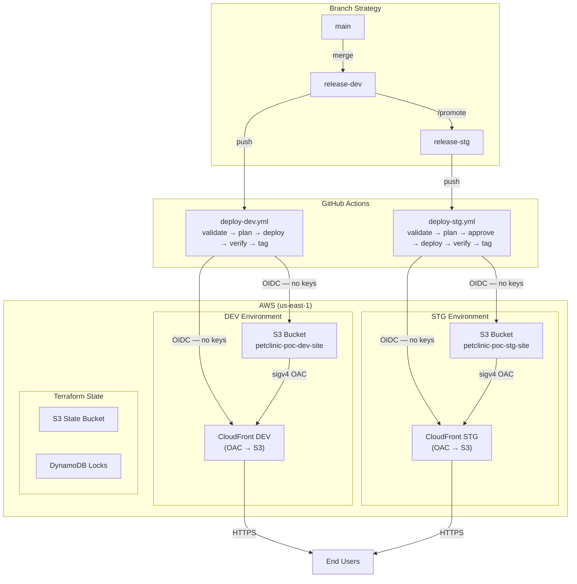

# Agentic AI Platform — Infrastructure (claude-devops)

Terraform IaC and Claude Code AI automation for the Agentic AI Platform.
Manages all AWS resources and CI/CD pipelines across DEV and STG environments.

> **Two-repo architecture:**
> - **This repo** (`claude-devops`) — Terraform, pipelines, Claude Code agents/skills
> - **UI repo** (`agenticai-ui`) — HTML/CSS site content, lightweight deploy pipelines

---

## Architecture



---

## Environments

| Environment | Branch | AWS Account | State Key | Auto-deploy |
|---|---|---|---|---|
| devtest | main (legacy) | 025760030746 | petclinic-poc/devtest/ | No |
| dev | release-dev | 025760030746 | petclinic-poc/dev/ | Yes |
| stg | release-stg | 025760030746 | petclinic-poc/stg/ | No — requires approval |

> Both environments share the same AWS account for this POC.
> Split accounts when promoting to production.

---

## Repository Structure

```
├── index.html / style.css / privacy.html / terms.html   # Site content
├── images/                        # Static assets
├── terraform/                     # All infrastructure (IaC)
│   ├── main.tf                    # S3, CloudFront, OAC
│   ├── iam.tf                     # GitHub OIDC role (scoped per env + branch)
│   ├── locals.tf                  # common_tags (Project, Environment, ManagedBy, ...)
│   ├── variables.tf               # Input variables with validation blocks
│   ├── outputs.tf                 # CloudFront URL, S3 bucket, role ARN
│   ├── providers.tf               # AWS provider, version constraints
│   ├── backend.tf                 # Remote state (partial config — values in backend.hcl)
│   ├── backend-infrastructure.tf  # State S3 bucket + DynamoDB lock table
│   └── example.tfvars.example     # Template — copy to terraform.tfvars
├── environments/
│   ├── dev/
│   │   ├── ci.tfvars              # DEV CI variables (committed, no secrets)
│   │   ├── backend.hcl.example    # DEV backend template (committed)
│   │   └── backend.hcl            # DEV backend secrets (gitignored)
│   └── stg/
│       ├── ci.tfvars              # STG CI variables (committed, no secrets)
│       ├── backend.hcl.example    # STG backend template (committed)
│       └── backend.hcl            # STG backend secrets (gitignored)
├── .github/workflows/
│   ├── deploy-dev.yml             # DEV pipeline (release-dev → validate/plan/deploy/verify/tag)
│   ├── deploy-stg.yml             # STG pipeline (release-stg → same + manual approval)
│   └── deploy-legacy.yml          # Original single-step workflow (kept for reference)
└── .claude/                       # Claude Code AI automation
    ├── agents/                    # 7 specialist agents
    ├── skills/                    # 14 slash-command skills
    └── hooks/                     # Safety hooks (UserPromptSubmit, PreToolUse, PostToolUse)
```

---

## For the Code Team

### Make a site change

1. Edit `index.html`, `style.css`, or other pages on the `main` branch
2. Merge to `release-dev` to trigger the DEV deploy pipeline
3. Verify on the DEV CloudFront URL: `cd terraform && terraform output cloudfront_domain_name`
4. Use `/promote dev` in Claude Code (or merge manually) to promote to STG after verification

### Preview locally

```bash
# Open index.html directly — no build step needed
start index.html        # Windows
open index.html         # macOS
xdg-open index.html     # Linux
```

### Files deployed to S3

All files in the repo root **except**:
`.git/`, `.github/`, `.claude/`, `terraform/`, `environments/`,
`*.md`, `*.txt`, `.mcp.json`, `.tool-versions`

---

## For the Infrastructure Team

### Prerequisites

```bash
terraform --version   # requires >= 1.5 (pinned: 1.14.4 via .tool-versions / .terraform-version)
aws --version         # AWS CLI v2
jq --version          # required for Claude Code hooks
```

### First-time setup (per environment)

```bash
# 1. Copy and fill in the backend config (gitignored — never commit)
cp environments/dev/backend.hcl.example environments/dev/backend.hcl
# Edit: set bucket = "terraform-state-{account-id}-us-east-1"

# 2. Copy and fill in the var file (gitignored — never commit)
cp terraform/example.tfvars.example environments/dev/terraform.tfvars
# Edit: set all values for the dev environment

# 3. Initialise with the dev backend
cd terraform
terraform init -backend-config=../environments/dev/backend.hcl

# 4. Plan and apply
terraform plan  -var-file=../environments/dev/terraform.tfvars
terraform apply -var-file=../environments/dev/terraform.tfvars
```

### Per-environment commands

```bash
# DEV
terraform init   -backend-config=../environments/dev/backend.hcl
terraform plan   -var-file=../environments/dev/terraform.tfvars
terraform apply  -var-file=../environments/dev/terraform.tfvars

# STG
terraform init   -backend-config=../environments/stg/backend.hcl
terraform plan   -var-file=../environments/stg/terraform.tfvars
terraform apply  -var-file=../environments/stg/terraform.tfvars
```

### Get live resource values

```bash
cd terraform
terraform output                          # all outputs
terraform output cloudfront_domain_name  # CloudFront URL
terraform output s3_bucket_name          # S3 bucket name
terraform output github_actions_role_arn # IAM role ARN (set as GitHub secret)
```

### Add a new environment

```bash
# In Claude Code:
/add-env prod
# Follow the printed checklist for manual steps
```

### Security model

| Control | Implementation |
|---|---|
| S3 access | Private bucket — CloudFront OAC only (sigv4 signing) |
| HTTPS | Viewer protocol policy: redirect HTTP → HTTPS |
| CI/CD auth | GitHub OIDC — no stored AWS access keys ever |
| IAM scope | Role trust locked to specific repo + branch |
| State security | S3 versioning + DynamoDB locking + AES256 encryption |
| Infra changes | Terraform only — never modify AWS resources manually |

---

## For the AI / Automation Team

### Claude Code skills

```
# Infrastructure
/scaffold-terraform [region] [name]  — generate all Terraform files (tf-writer agent)
/scaffold-cicd [account-id] [env]    — generate GitHub Actions workflow + OIDC role
/tf-plan                             — terraform plan + risk analysis
/tf-apply                            — terraform apply + verify outputs
/infra-status                        — health dashboard of all resources
/infra-audit                         — parallel security + cost + drift audit

# Deployment
/deploy                              — sync S3 + invalidate CloudFront
/validate-env [dev|stg]              — pre-flight checks before deploying
/rollback [dev|stg]                  — restore previous S3 version + invalidate CF

# Release management
/promote [dev]                       — merge release-dev → release-stg (with confirmation)
/tag-release [dev|stg] [sha]         — create annotated release-{env}-SHA-{sha} git tag

# Environment management
/add-env [name]                      — scaffold new environment directory + backend template
/setup-gh-actions [create|validate]  — create or validate CI workflow
```

### Claude Code agents

| Agent | Purpose | Model |
|---|---|---|
| `tf-writer` | Generate Terraform code, run fmt + validate after writing | sonnet |
| `security-auditor` | Audit IaC for security issues (CRITICAL/HIGH/MEDIUM/LOW) | sonnet |
| `cost-optimizer` | Review infra for cost savings, flag absent `price_class` | haiku |
| `drift-detector` | Detect drift via `terraform plan -detailed-exitcode` | haiku |
| `release-manager` | Git tagging and branch promotion | sonnet |
| `env-provisioner` | Bootstrap new environment directories and checklists | sonnet |
| `pipeline-validator` | Audit GitHub Actions workflows for DevSecOps compliance | haiku |

### Safety hooks

| Hook | Trigger | Action |
|---|---|---|
| `user-prompt-guard.sh` | Every user message | Blocks: "nuke", "wipe", "delete all", "destroy everything" |
| `pre-tool-guard.sh` | Every Bash tool call | Blocks: `terraform destroy`, `terraform apply -auto-approve`, `aws s3 rm` |
| `post-tool-logger.sh` | Every Bash tool call | Logs every `terraform apply` to `.claude/deploy.log` |

Hooks use relative paths and `git rev-parse --show-toplevel` — work on any
machine without modification. Require `jq` (see New Machine Setup).

---

## For On-call / SRE

### Roll back a bad deploy

```bash
# Via Claude Code:
/rollback dev     # or: /rollback stg

# Manually:
BUCKET=$(cd terraform && terraform output -raw s3_bucket_name)
DIST=$(cd terraform && terraform output -raw cloudfront_distribution_id)

# List recent S3 versions
aws s3api list-object-versions --bucket "$BUCKET" --prefix index.html --max-items 5

# Restore a specific version
aws s3api copy-object \
  --bucket "$BUCKET" \
  --copy-source "$BUCKET/index.html?versionId=<VERSION_ID>" \
  --key index.html

# Invalidate CloudFront cache
aws cloudfront create-invalidation --distribution-id "$DIST" --paths "/*"
```

### Force CloudFront cache invalidation

```bash
DIST=$(cd terraform && terraform output -raw cloudfront_distribution_id)
aws cloudfront create-invalidation --distribution-id "$DIST" --paths "/*"
```

### Check CloudFront distribution status

```bash
DIST=$(cd terraform && terraform output -raw cloudfront_distribution_id)
aws cloudfront get-distribution --id "$DIST" --query "Distribution.Status" --output text
```

### Check S3 bucket contents

```bash
BUCKET=$(cd terraform && terraform output -raw s3_bucket_name)
aws s3 ls "s3://$BUCKET/" --recursive --human-readable
```

### View deploy audit log

```bash
cat .claude/deploy.log
```

### Troubleshooting

**Access Denied from CloudFront:**
- Verify S3 bucket policy allows CloudFront OAC (`terraform show`)
- Check OAC is attached to the CloudFront origin
- Invalidate cache and wait 30-60 seconds

**Site not updating after deploy:**
- Confirm files are in S3: `aws s3 ls s3://$BUCKET/`
- Invalidate CloudFront cache
- Check GitHub Actions workflow completed all 5 jobs

**Terraform state issues:**
- Verify `environments/{env}/backend.hcl` exists with correct bucket name
- Run `terraform init -backend-config=../environments/{env}/backend.hcl -reconfigure`
- Use `/validate-env dev` for a full pre-flight check

---

## GitHub Setup (First Time)

Configure these before the first pipeline run.

### Secrets — Actions → Secrets → Actions

| Secret | Value | How to get |
|---|---|---|
| `AWS_ROLE_ARN_DEV` | IAM role ARN for DEV | `cd terraform && terraform output github_actions_role_arn` |
| `AWS_ROLE_ARN_STG` | IAM role ARN for STG | same after applying STG environment |

### Variables — Actions → Variables → Actions

| Variable | Value |
|---|---|
| `TF_STATE_BUCKET` | `terraform-state-{aws-account-id}-us-east-1` |

### Environments — Settings → Environments

| Environment | Protection rule |
|---|---|
| `dev` | None — auto-deploy on push to release-dev |
| `stg` | Required reviewer — add yourself before first STG deploy |

---

## New Machine Setup

Hooks use relative paths and require `jq` for JSON parsing.
No path configuration needed after cloning.

### Install jq

```bash
# Windows (Git Bash) — no admin required
mkdir -p ~/bin
curl -sL "https://github.com/jqlang/jq/releases/download/jq-1.7.1/jq-windows-amd64.exe" \
  -o ~/bin/jq.exe

# Windows — Chocolatey (admin shell)
choco install jq -y

# macOS
brew install jq

# Ubuntu / Debian
sudo apt-get install jq

# RHEL / Fedora
sudo dnf install jq
```

### Make hooks executable (Linux/macOS only)

```bash
chmod +x .claude/hooks/*.sh
```

### Verify hooks work

```bash
# Should be BLOCKED (exit 2):
echo '{"tool_input":{"command":"terraform destroy"}}' | bash .claude/hooks/pre-tool-guard.sh

# Should PASS silently (exit 0):
echo '{"tool_input":{"command":"terraform validate"}}' | bash .claude/hooks/pre-tool-guard.sh

# Should write an entry to deploy.log:
echo '{"tool_input":{"command":"terraform apply"}}' | bash .claude/hooks/post-tool-logger.sh
cat .claude/deploy.log | tail -1

# Should output a block decision:
echo '{"prompt":"nuke everything"}' | bash .claude/hooks/user-prompt-guard.sh
```

---

## Cost

| Resource | Monthly cost |
|---|---|
| S3 storage | < $0.10 (small HTML/CSS files) |
| CloudFront (PriceClass_100) | Free tier: 1 TB/month, then ~$0.085/GB |
| DynamoDB state lock | Free (PAY_PER_REQUEST, negligible traffic) |
| **Total** | **~$0–$5/month** |

WAF intentionally excluded — adds ~$5+/month base cost, not needed for POC.

---

## Resources

- [Terraform AWS Provider](https://registry.terraform.io/providers/hashicorp/aws/latest)
- [CloudFront Origin Access Control](https://docs.aws.amazon.com/AmazonCloudFront/latest/DeveloperGuide/private-content-restricting-access-to-s3.html)
- [GitHub OIDC with AWS](https://docs.aws.amazon.com/IAM/latest/UserGuide/id_roles_providers_create_oidc.html)
- [Claude Code documentation](https://claude.ai/code)

---

**Project:** petclinic-poc | **Terraform:** 1.14.4 | **AWS Provider:** ~> 5.0 | **Updated:** 2026-05-28
